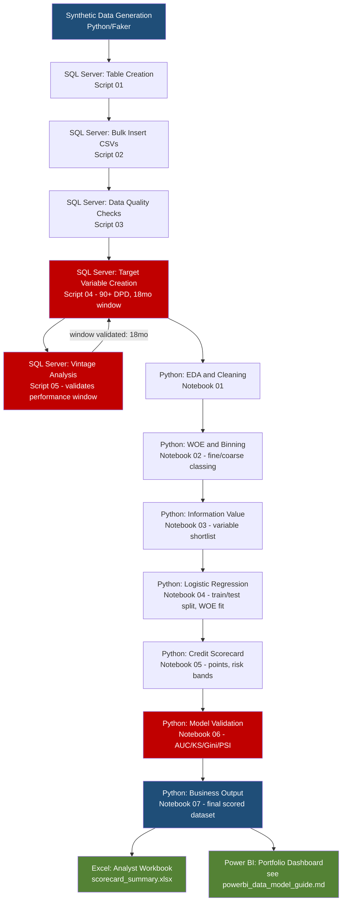

# End-to-End Workflow Diagram
## Meridian Trust Bank — Personal Loan Application Credit Scorecard

## Key feedback loop (highlighted in red above)

Target Variable Creation (E) and Vintage Analysis (F) are drawn as a loop,
not a straight line — because that's what actually happened in this
project. The initial 12-month performance window assumption was tested by
Vintage Analysis, found inadequate (~20-26% of eventual bads still missing
at MOB 12), and revised to 18 months. **This loop is the single most
important structural lesson of the whole project**: target definition is
not a one-shot assumption locked in before modeling — it's validated,
revised, and re-validated against the data before anything downstream is
built on top of it.

## Data lineage summary

| Stage | Input | Output | Format |
|---|---|---|---|
| 1. Data Gathering | Synthetic generation | 5 raw tables | CSV |
| 2. Target Creation | Raw tables | `vw_application_target`, `vw_modeling_dataset` | SQL views |
| 3. Vintage Analysis | `loan_performance` | Window validation decision | SQL query output |
| 4. EDA | `modeling_dataset.csv` | Cleaned understanding, no new file | Notebook |
| 5. WOE/Binning | `modeling_dataset.csv` | `final_coarse_bins.json` | JSON |
| 6. IV | Binned data | `stage7_shortlist.json`, `stage7_iv_lookup.json` | JSON |
| 7. Logistic Regression | Shortlist + bins | `stage7_model_artifacts.pkl`, scored train/test | Pickle + CSV |
| 8. Scorecard | Model artifacts | `stage8_scorecard.json`, scored datasets | JSON + CSV |
| 9. Validation | Scored datasets | Performance metrics (in-notebook) | Notebook output |
| 10. Business Output | All of the above | `final_scored_applications.csv` | CSV -> Excel -> Power BI |
