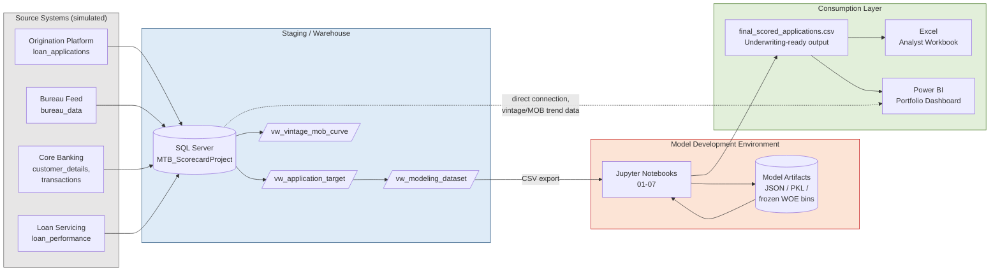

# System Architecture & Data Flow
## Meridian Trust Bank — Personal Loan Application Credit Scorecard

This diagram shows the project at **infrastructure/systems level** — which
environments, tools, and storage layers data moves through — as distinct
from `06_deliverables/workflow_diagram.md`, which shows the **analytical
methodology** (Stage 1 through Stage 10). A platform or data engineering
team would draw this diagram; a risk analyst would draw the other one.

## Environment boundaries and why they matter

| Boundary | What crosses it | Why it's a real boundary, not just a folder |
|---|---|---|
| **Source Systems -> SQL Server** | Raw CSVs, loaded via `BULK INSERT` (Script 02) | In production this would be a scheduled ETL/ELT job (e.g. ADF, Fivetran, dbt), not a manual file copy -- the CSV-and-BULK-INSERT pattern here stands in for that, and is exactly the kind of thing you'd replace with a proper ingestion pipeline before going live |
| **SQL Server -> Model Development** | `vw_modeling_dataset`, exported to CSV | This is a genuine environment boundary in most banks: the SQL warehouse is typically a governed, access-controlled environment; the data science/model development environment (Jupyter, Python) usually runs elsewhere (a sandboxed VM, a notebook service) with its own access controls. Data physically leaves the database the moment it's exported to CSV -- worth being deliberate about what leaves and why |
| **Model Development -> Consumption Layer** | `final_scored_applications.csv`, frozen model artifacts | This is the model governance boundary -- once artifacts leave the dev environment, they're meant to be FROZEN (the WOE bins, coefficients, and scorecard points table shouldn't silently change without a formal model version bump). See `docs/model_governance_notes.md` |

## What's simulated vs what a real deployment would add

This project simulates the analytical pipeline end-to-end, but a real bank's
production deployment would add layers this project deliberately doesn't
build, since they're infrastructure/MLOps concerns rather than credit risk
methodology:

- **Automated scheduling** (Airflow/ADF/cron) instead of `src/run_pipeline.py`
  being run manually
- **A model registry** (e.g. MLflow) versioning each scorecard artifact,
  rather than a single `stage8_scorecard.json` file
- **A real-time or batch scoring API** sitting in front of the frozen
  scorecard, rather than a static `final_scored_applications.csv`
- **Access controls and data lineage tooling** (e.g. Unity Catalog, Purview)
  governing who can read `bureau_data` vs who can only read the final
  score, given the sensitivity of raw bureau attributes
- **Automated PSI/drift monitoring** running on a schedule against live
  scored applications, rather than the one-time Stage 9 calculation against
  a static test set

`src/run_pipeline.py` in this project is a deliberately simple stand-in for
what an Airflow DAG or ADF pipeline would do in production -- it
demonstrates the ORDERING and dependency logic (each stage's log entry
shows what a real scheduler log looks like) without the operational
complexity of an actual scheduler.
